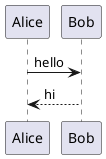

# PlantUML for ChatGPT

A Chrome extension that renders ` ```plantuml ` code blocks directly in ChatGPT conversations, using the TeaVM-compiled PlantUML engine that runs entirely client-side.

**No server. No tokens. No tracking. Local rendering.**

## Installation

- From the Chrome Web Store after publication (listing assets are in `store/`)
- For local testing, load the `Chrome/` directory as an unpacked extension


## Live demo

With the extension installed and active, the block below should render as a sequence diagram:



## How it works

1. The extension's content script scans completed ChatGPT messages for `plantuml` code blocks. Blocks with no language marker are recognized by matching PlantUML's own `@startXXX` / `@endXXX` delimiters in the text.
2. Each block is replaced with a sandboxed `<iframe>` packaged inside the extension.
3. The iframe loads the TeaVM-compiled `plantuml.js` engine and renders the diagram to SVG.
4. The result is displayed inline in the conversation, inside a small wrapper with a header bar.
5. The header bar shows a **toggle button** that switches between the rendered diagram and the original PlantUML source.

The renderer is local and does not send conversation content to a server.

## Security & permissions

The extension requests only `clipboardWrite` so its copy buttons can write SVG
and PNG data. It has no storage, tabs, account, or network permissions. The
content script is scoped to `chatgpt.com` and the renderer is packaged locally.

The extension also runs under the stock Manifest V3 Content Security Policy
(essentially `script-src 'self'`), with no relaxation at all. Diagrams that
need graph layout (**class, component, deployment, state, and use-case
diagrams**) are laid out by **Smetana**, PlantUML's built-in port of the
Graphviz layout algorithms, which is compiled into the same `plantuml.js`
file as the rest of the engine. There is no WebAssembly module and no
`'wasm-unsafe-eval'` directive in the manifest.

The renderer runs as a single packaged JavaScript file under the stock
Manifest V3 policy and does not require a remote service.

In short: the engine runs entirely inside a sandboxed iframe with an opaque
origin, with no network access and no shared state with the host page.

## Testing in ChatGPT

To test quickly, start a new ChatGPT conversation with this content:

````markdown

````

After the message is complete, the diagram should appear.

## Roadmap

- [x] MVP: detect and render `plantuml` blocks
- [X] Firefox support (Manifest V3 is now supported in Firefox)
- [X] "Copy SVG" / "Copy source" buttons
- [x] Theme matching (light/dark)
- [x] Support `puml` and `wsd` language aliases
- [x] Detect untagged blocks via `@startXXX`/`@endXXX` sniffing
- [ ] Options page (toggle, performance settings)
- [X] Chrome Web Store publication

## Why this extension exists

ChatGPT can explain PlantUML diagrams but does not render them inline. This
extension adds local rendering without exposing conversation content to a
third-party service.

## Installation for Chrome (developer mode)

### Step 1 — Load the extension in Chrome

1. Open `chrome://extensions/`
2. Toggle **Developer mode** on (top-right)
3. Click **Load unpacked**
4. Select the `Chrome/` folder

### Step 2 — Test it

Visit [chatgpt.com](https://chatgpt.com/) and create a message containing a
` ```plantuml ` block. The renderer also supports `puml`, `wsd`, and complete
`@startXXX`/`@endXXX` blocks without a language marker.

You should see the diagram rendered inline, with a small "🌱 PlantUML (client-side render)" badge above it. Click the toggle button (the `<>` icon to the left of the badge) to switch to the original source view; click it again (it now shows an eye icon) to switch back to the diagram.


## License

MIT
